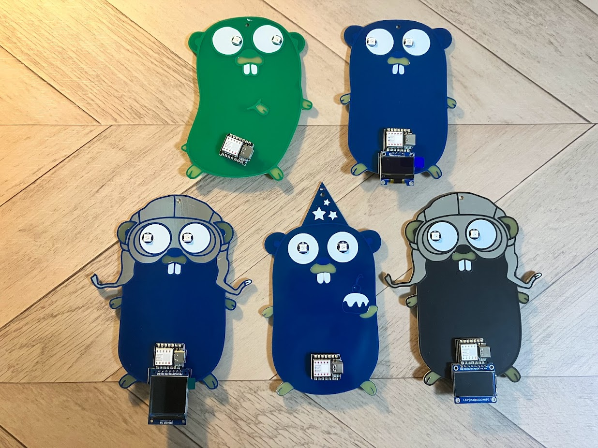
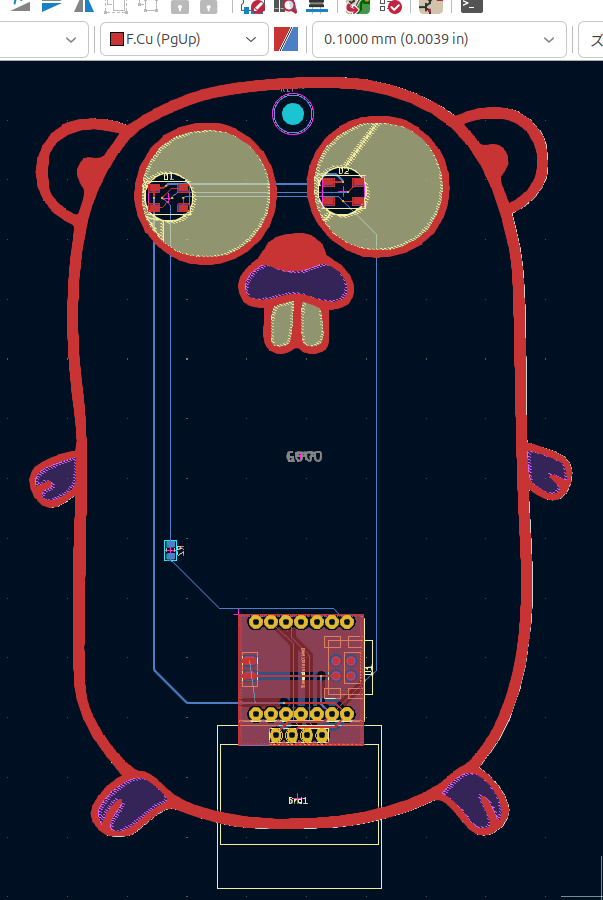

# gopher-board

Let's make your own Gopher Board, and enjoy tinygo!

## Usage

1. clone this repository to your pc.
2. Add the cloned gopher.pretty folder to the footprint library path of kicad.
3. make your own board!

The example folder contains the data of the kicad projects that I have created so far.
You can also use this as is.

I have confirmed that the project can be opened using kicad 8.0.

## Thanks

The Go gopher was designed by Renee French.
[http://reneefrench.blogspot.com/](http://reneefrench.blogspot.com/)
